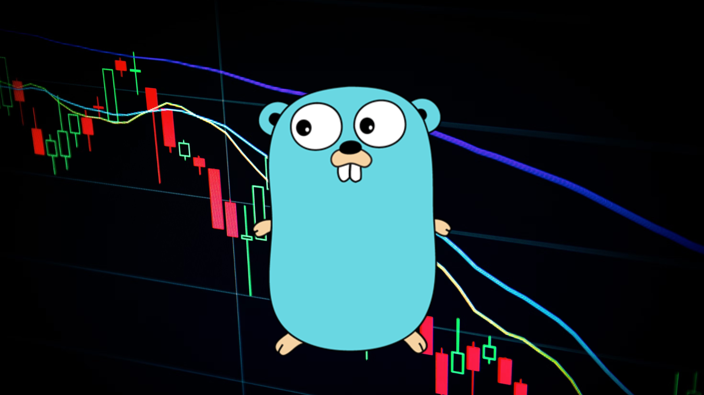

<a name="readme-top"></a>


<!-- PROJECT LOGO -->
<br />
<div align="center">
  <a href="https://github.com/mikah13/ggs">
    
  </a>

  <h3 align="center">go-get-stock</h3>

  <p align="center">
    A CLI tool written in Golang to display stocks price in real time using Yahoo Finance API
  </p>
</div>


## Introduction

GGS (Go Stock Viewer) is a command-line tool written in Go for viewing stock prices and managing a watchlist of stocks. It allows you to quickly retrieve stock prices and display them in a tabular format. You can also manage your watchlist by adding or removing tickers as needed.

## Installation

To use GGS, follow these steps:

1. **Clone the repository:**
  ```sh
  git clone https://github.com/mikah13/ggs


2. **Navigate to the project directory:**
  ```sh
  cd ggs

3. **Build the executable:**
  ```sh
  go build .

## Usage

Once you have built the executable, you can use the following command-line options:

- `./ggs get [ticker]`: Display stock prices in a table. You can also search for multiple tickers using semicolon "," as the delimiter
- `./ggs get-all`: Display the watchlist in a table.
- `./ggs list`: Display an editable list of all tickers in the watchlist.
- `./ggs add [ticker]`: Add a ticker to the watchlist.

For example: You can use `get` for a single or multiple tickers search 
  ```sh
  ./ggs get MSFT

  ```sh
  ./ggs get AAPL,META

  
